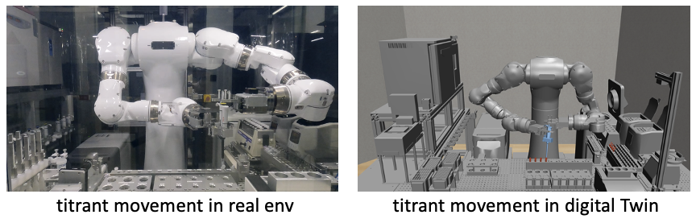

# Development of AI-Driven Digital Twins for Motion Control Learning in Laboratory Automation 

## 実験ロボットの動作学習のためのAI駆動デジタルツインの開発

> [!NOTE]
>
> This repository is only for display.
>
> The source code of Digital Twin and RL script is not in public in this step.

## Ⅰ. Abstract

* **Lab automation with experimental robots**: Addressing issues like labor-intensive lab operations, hazardous experiments, subjectivity in techniques, and research misconduct.

* **Current Issues of experimental robots**: Specific tasks limitation, lack flexibility, requiring predetermined equipment placement.

* **In this study**
  * We Built a virtual laboratory (Digital Twin) on computer, and are going to learn flexible experimental actions through AI, then transfer into real-world robot. 
  * Taking the versatile dual-arm experimental robot, [Maholo](https://www.aist.go.jp/aist_j/highlite/2015/vol3/index.html), as a subject, we demonstrate its learning actions built on a simulator.

 

## Ⅱ. Methods and results

### ①. Digital Twin development ([Fusion](https://www.autodesk.co.jp/products/fusion-360) -> [robosuite](https://robosuite.ai/), [Mujoco](https://mujoco.org/) background)

* **Parameters:**
  * **Robot:** Joint position and posture, speed limit, etc. are as per the instruction manual.
  * **Arena:** Position and posture are determined by Fusion.
  * **Object:** Position and posture are determined by Blender. Physical parameters like friction coefficient are arbitrary.

* **3D Models:**
  * Export from Fusion in STL or OBJ format.
  * Non-Convex Problem: [VHAD](https://github.com/Unity-Technologies/VHACD); or reconstruct by Blender.

### ②. Experimental actions learning (Task: Grab a pipette and move to a tube)

* **Behavior cloning**

  

* **Reinforcement learning**

  * Train model - SAC (based on [Stable-baseline3](https://github.com/DLR-RM/stable-baselines3))

  

  * Sample of robot movement.

  

  * Video of robot movement based on HRL.

    
  
  * Video of robot movement displayed by RViz.
  
    
  
  * Correspondence between real and virtual space.
  
  
